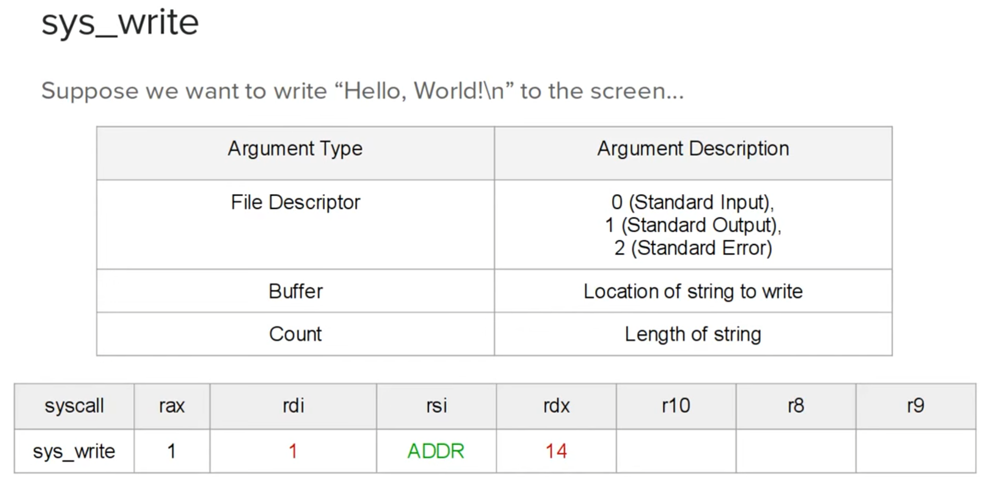

# asm_x86_64

A collection of basic x86_64 assembly language programs for learning and exploration.

## Description

This repository contains various assembly programs written in **x86_64** architecture. It is a learning resource to understand assembly language programming, instruction sets, and system-level programming concepts. The projects are designed to help you get hands-on experience with low-level programming and the inner workings of the computer.

[Reference Video](https://youtube.com/playlist?list=PLetF-YjXm-sCH6FrTz4AQhfH6INDQvQSn&feature=shared)

## Installation

### Prerequisites

Before you begin, make sure you have the following installed:

- **NASM**: The assembler used to compile x86_64 assembly programs.
- **LD**: The linker to link the object files and create executables.

You can install **NASM** and **LD** on your Linux system using the following commands:

```bash
sudo apt update
sudo apt install nasm
sudo apt install binutils
```

### Cloning the repository:
```bash
git clone https://github.com/yourusername/asm_x86_64.git
cd asm_x86_64
```

### Usage:
- Compile and link an assembly program
  ```bash
  nasm -f elf64 -o output.o program.asm
  ld output.o -o program
  ```
- Run the program:
  ```bash
  ./program
  ```


## Registers

Registers are a part of the processor that temporarily holds memory.
> In the x86_64 architecture, register hold 64 bits.


## System Call
- A __system call__, or a __syscall__, is when a program requests a service from the kernel.
- System calls will differ by operating system because different operating systems use different kernels.
- All __syscalls__ have an ID associated with them (a number).
- __Syscalls__ also take arguments, meaning, a list of inputs.


### Lets say we want to write hello world:




### `sys_exit(0)` - Exit with error 0.


# Sections:


# Flags


# Pointers.

 


# Stack

> Peeking is simply looking at the top without removing or adding anything to it.